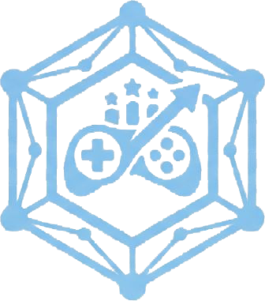

<div>



</div>

GamificationHub is a platform that permits to define and execute score based games.
## Tech Stack

**Backend**


**Frontend**


**Infrastructure & Observability**


## Components
* [game-engine.core](game-engine.core): Drools rule engine implementation and domain models
* [game-engine.api](game-engine.api): Spring Boot REST API and security layer
* [game-engine.webapp](game-engine.webapp): React + Vite admin web interface
* [monitoring](monitoring): Prometheus, Grafana, Loki and Alloy configuration for observability
* [documentation](documentation): project documentation and API migration notes


## Running the application

The application has three parts: MongoDB (plus optional monitoring), the `game-engine.api` backend and the `game-engine.webapp` frontend.

### Prerequisites
* JDK 25 and Maven 3.9+
* Node.js 20+ and npm
* Docker and Docker Compose

### 1. Start the infrastructure
From the repository root, use `docker-compose.local.yaml` — the local-development compose file, which includes MongoDB (and the monitoring stack):
```
docker compose -f docker-compose.local.yaml up -d mongo
```
MongoDB is exposed on `localhost:50000`.

### 2. Start the backend API
From `game-engine.api`, run the Spring Boot app (defaults to the `local` profile, listens on port `8080`):
```
cd game-engine.api
mvn spring-boot:run
```

### 3. Start the frontend webapp
From `game-engine.webapp`, install dependencies and start the Vite dev server:
```
cd game-engine.webapp
npm install
npm run dev
```
The dev server runs on `http://localhost:5173` and proxies `/api` requests to the backend on port `8080`.

### Running everything with Docker (local development)
Alternatively, build and run the full stack (MongoDB, API, webapp and monitoring) with `docker-compose.local.yaml` — this is the compose file meant for local development; it bundles the split `docker-compose.backend.yaml` and `docker-compose.frontend.yaml` together with a local-only MongoDB:
```
docker compose -f docker-compose.local.yaml up --build
```

The API takes a .env.prod file to run. Ask the administrator to provid the file as it contains sensitive information.

### Deployment

`docker-compose.backend.yaml` and `docker-compose.frontend.yaml` are deployed separately (e.g. as two Coolify resources) and don't include MongoDB — it's expected to run as its own managed database resource. See [documentation](documentation) for details.
